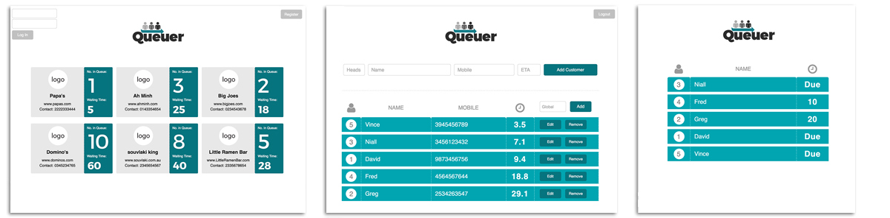

# Queuer - A queue cure
WDI-7 Group Project 3 - Collaboration with Jason Low and Niall O'Callaghan.

### App Description:
Queuer was designed and built to solve waiting/queue problems for busy inner city restaurants. Customers are given an estimated queue waiting time by based on head numbers. Customers then go away with virtual position in the queue monitored through a mobile device, to return when their time is due.

### Functionality:
A restful API created using Node.js, Express.js and MondoDB that is consumed by a jQuery/Ajax front-end - The app allows a restaurant owner to login securely with a jwt token - then add and track customers in a GUI queue system with a countdown timer.

##### 3 views:
1. Public view for customers to get an overview of restaurants and there queue base.
2. Restaurant view for all admin CRUD functions.
3. Customer view for queue monitoring only.

### Tools:
* Node.js, Express.js, MongoDB
* HTML5, jQuery, Ajax, CSS
* Moment.js to parse, validate and manipulate display countdown timers

### Installation
Front-end (Ajax): https://github.com/peterdaniel-fewd/restaurant-waitlist-frontend
Back-end (Node.js): https://github.com/peterdaniel-fewd/restaurant-waitlist-v2

### Known Bugs
- Phone numbers can't have spaces for front-end CRUD. Can be fixed with a pre.save in the model that replaces spaces with dashes '-'.

### Extensions
- Rebuild with Angular.js
- Add VIP function to allow special preferences to certain customers.
- An ability to sms a individual url (based on mobile number) for customers to monitor their position and give an alert when ready.
